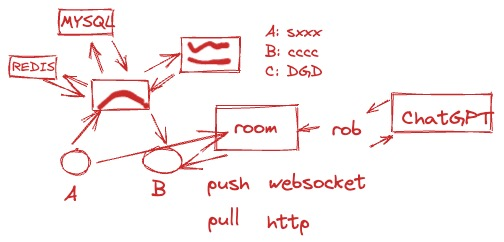

# go语言


```shell
# For golang
export GOROOT=/usr/local/go
export PATH=$PATH:$GOROOT/bin

export GOPATH=~/workspace/gocode
export PATH=$PATH:$GOPATH/bin
```

- Hello World

```go
package main

import "fmt"

func main() {
 fmt.Println("Hello, 世界")
}
```

- gofmt

- 命令行参数

```go
package main

import (
	"fmt"
	"os"
)

func main() {
	s, sep := "", ""
	for _, arg := range os.Args[1:] {
		s += sep + arg
		sep = " "
	}
	fmt.Println(s)
}
```

- fmt.Printf

```
%d decimal integer
%x, %o, %b integer in hexadecimal, octal, binary
%f, %g, %e floating-point number: 3.141593 3.141592653589793 3.141593e+00
%t boolean: true or false
%c rune (Unicode code point)
%s string
%q quoted string "abc" or rune 'c'
%v any value in a natural format
%T type of any value
%% literal percent sign (no operand)
```

- Web Server

```go
package main

import (
	"fmt"
	"log"
	"net/http"
	"sync"
)

var mu sync.Mutex
var count int

func main() {
	http.HandleFunc("/", handler) // each request calls handler
	http.HandleFunc("/count", counter)
	http.HandleFunc("/echo", echo)
	log.Fatal(http.ListenAndServe("localhost:8000", nil))
}

// handler echoes the Path component of the request URL r.
func handler(w http.ResponseWriter, r *http.Request) {
	mu.Lock()
	count++
	mu.Unlock()
	fmt.Fprintf(w, "URL.Path = %q\n", r.URL.Path)
}

// counter echoes the number of calls so far
func counter(w http.ResponseWriter, r *http.Request) {
	mu.Lock()
	fmt.Fprintf(w, "Count %d\n", count)
	mu.Unlock()
}

func echo(w http.ResponseWriter, r *http.Request) {
	fmt.Fprintf(w, "%s %s %s\n", r.Method, r.URL, r.Proto)
	for k, v := range r.Header {
		fmt.Fprintf(w, "Header [%q] = %q\n", k, v)
	}

	fmt.Fprintf(w, "Host = %q\n", r.Host)
	fmt.Fprintf(w, "RemoteAddr = %q\n", r.RemoteAddr)
	if err := r.ParseForm(); err != nil {
		log.Print(err)
	}
	for k, v := range r.Form {
		fmt.Fprintf(w, "Form[%q] = %q\n", k, v)
	}
}
```

- [go playground](https://go.dev/play/)

- 包和文件的关系
	- pacakge -> file.go

- 声明
	- 5种主要的声明：```var, const, type, func```

- 变量声明

```go
var name type = expression
```

```go
var name type
name = expression
```

> 注：短变量声明的方式有一些坑

```go
name := expression
```

- 指针
	- 指针里保存的变量的地址
	- 可以通过指针修改变量
	- & : 取变量地址
	- \* ： 取值（相当于变更的别名）

- 另外一个命令行参数flag

```go
package main

import (
	"flag"
	"fmt"
	"strings"
)

var n = flag.Bool("n", false, "omit trailing newline")
var sep = flag.String("s", " ", "separator")

func main() {
	flag.Parse()
	fmt.Print(strings.Join(flag.Args(), *sep))
	if !*n {
		fmt.Println()
	}
}
```

- 有三个操作符返回多值

```go
v, ok = m[key] 	// map lookup
v, ok = x.(T)	// type assertion
v, ok = <-ch	// channel receive
```

- HTTP的方法
	- GET
	- POST
	- PUT
	- DELETE

- pull 或 push



- iota

> A const declaration may use the constant generator iota, which is used to create a sequence of related values without spelling out each one explicitly. 


```go
const (
    _ = 1 << (10 * iota)
    KiB // 1024
    MiB // 1048576
    GiB // 1073741824
    TiB // 1099511627776
    PiB // 1125899906842624
    EiB // 1152921504606846976
    ZiB // 1180591620717411303424
    YiB // 1208925819614629174706176
)
```

---

- 参考链接：[Effective Go](https://go.dev/doc/effective_go)
- 参考书籍：《The Go Programming Language》
